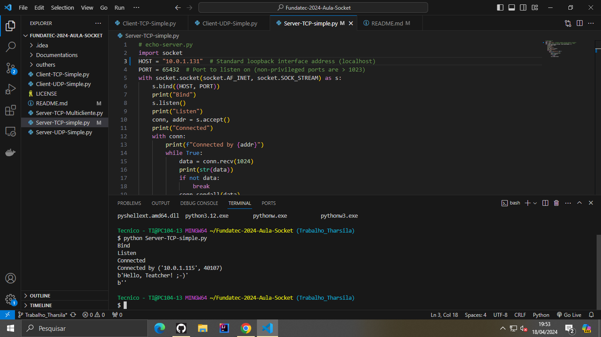

Estes sockets fazem parte das aulas de redes de computadores!

Enjoy meus alunos!

Alunos!!!

# Trabalho socket

Estes sockets fazem parte das aulas de redes de computadores!
Enjoy meus alunos!

Alunos!!!
***
## Sobre o trabalho

Documente com print e coloque aqui as respostas

### Simple server TCP :

1) Subir o tcp server simple explicar os estados da conexão, bind, listen etc.

### Estados de conexão

SYN_SENT: o cliente envia uma solicitação de conexão (SYN) para o servidor.   
SYN_RECEIVED: o servidor recebe a solicitação de conexão SYN e responde com sua própria solicitação de conexão SYN, ACK (acknowledgment).     
ESTABLISHED: o cliente recebe a resposta SYN, ACK do servidor e envia um ACK de confirmação. A conexão é estabelecida.     

Escuta e Aceitação de Conexões:  

LISTENING: o servidor está esperando por conexões de entrada.      
ESTABLISHED: quando uma conexão é aceita pelo servidor, ela entra no estado ESTABLISH.   

***
### Métodos utilizados:

socket.socket(): Cria um objeto socket. AF_INET indica que estamos usando a família de endereços IPv4 e SOCK_STREAM indica que estamos usando TCP.  
bind(): Liga o socket ao endereço (host) e porta especificados. Isso associa o servidor a uma interface de rede e a uma porta no host.    
listen(): Coloca o socket no modo de escuta, permitindo que aceite conexões de clientes. O argumento especifica o número máximo de  conexões pendentes que podem ser enfileiradas para processamento.      
accept(): Aceita uma conexão pendente. Retorna um novo socket (client_socket) e o endereço do cliente (addr), que podem ser usados para  enviar e receber dados do cliente.    
send(): Envie dados ao cliente conectado. Aqui, estamos enviando uma mensagem de confirmação ao cliente.    
close(): Fecha o socket.    


2) Executar o programa de cliente simple server tcp e verificar os estados da conexão.

 Executado o "localhost" (192.168.0.21) na porta "65432", envia uma mensagem de teste ("Hello, world!").  
 Apresentando a frase "Hello, world" na tela.  


3) Analise o código fonte

```

O primeiro passo é importar o módulo `socket`, que fornece suporte para sockets no Python.  

import socket  

Criação do Socket do Servidor:
Em seguida, criamos um objeto de socket usando socket.socket(). Aqui, especificamos socket.AF_INET para indicar que estamos usando a família de endereços IPv4 e socket.SOCK_STREAM para indicar que estamos usando TCP.    
 **server_socket = socket.socket(socket.AF_INET, socket.SOCK_STREAM)**

Definição do Host e Porta:
A seguir, obtemos o nome da máquina local usando socket.gethostname() e definimos a porta em que o servidor estará escutando conexões.  
 **host = socket.gethostname()port = 12345**  

Vinculação do Socket:  
Usamos o método bind() para vincular o socket ao host e à porta especificados. Isso associa o servidor a uma interface de rede e a uma porta no host.

 **server_socket.bind((host, port))**  

Modo de Escuta:  
Em seguida, usamos o método listen() para colocar o socket no modo de escuta. O argumento passado indica o número máximo de conexões pendentes que podem ser enfileiradas para processamento.  
 **server_socket.listen(5)**

Aceitação de Conexões:  
Entramos em um loop while True para esperar por conexões de clientes. Dentro do loop, usamos o método accept() para aceitar uma conexão pendente. Isso retorna um novo socket (client_socket) que representa a conexão com o cliente e o endereço do cliente (addr).
**while True:
    client_socket, addr = server_socket.accept()**  

Envio de Mensagem ao Cliente:  
Dentro do loop, após aceitar uma conexão, enviamos uma mensagem de confirmação ao cliente usando o método send(). Aqui, a mensagem é codificada em UTF-8 antes de ser enviada.  
**msg = "Conexão estabelecida com o servidor TCP"
client_socket.send(msg.encode('utf-8'))**

Fechamento do Socket do Cliente:  
Após enviar a mensagem, fechamos o socket do cliente usando o método close().  
  **client_socket.close()**

```
---

4) Analise usando o wireshark explicando os pacotes.


5) Diferencie a conexão UDP de TCP

UDP (User Datagram Protocol) e TCP (Transmission Control Protocol) são dois protocolos de transporte amplamente utilizados na comunicação de redes. Algumas diferenças entre eles:

1. **Confiabilidade e Garantia de Entrega:**
   - TCP: É um protocolo orientado à conexão, garantindo a entrega ordenada e confiável dos dados. Ele faz uso de confirmações e retransmissões para garantir que os dados sejam entregues corretamente e na ordem correta.
   - UDP: É um protocolo não orientado à conexão, o que significa que não há garantia de entrega ou ordem de entrega dos pacotes. Os pacotes podem ser perdidos ou chegar fora de ordem, e não há mecanismo embutido para retransmiti-los automaticamente.

2. **Overhead:**
   - TCP: Devido aos mecanismos de controle de fluxo, controle de congestionamento e garantia de entrega, o TCP tende a ter um overhead maior em comparação com o UDP.
   - UDP: Sendo um protocolo mais simples, o UDP tem um overhead menor em comparação com o TCP.

3. **Conexão:**
   - TCP: Estabelece uma conexão antes de iniciar a transferência de dados. Isso inclui uma fase de handshaking para estabelecer parâmetros de comunicação entre as partes.
   - UDP: Não estabelece uma conexão antes de enviar os dados. Os pacotes podem ser enviados sem a necessidade de handshaking ou estabelecimento de conexão.

4. **Aplicações típicas:**
   - TCP: É mais adequado para aplicações que requerem entrega confiável de dados e controle de fluxo, como transferência de arquivos, navegação na web e email.
   - UDP: É usado em aplicações onde a latência é crítica ou onde a perda de alguns pacotes não é tão crucial, como jogos online, streaming de mídia e voz sobre IP (VoIP).

5. **Velocidade:**
   - TCP: Devido ao seu mecanismo de garantia de entrega e controle de fluxo, o TCP pode ser mais lento em comparação com o UDP, especialmente em redes com alta latência ou perda de pacotes.
   - UDP: Como não há overhead para garantia de entrega e controle de fluxo, o UDP tende a ser mais rápido do que o TCP em situações onde a latência é crítica.

Enquanto o TCP oferece garantia de entrega e controle de fluxo em troca de um overhead maior, o UDP oferece baixa latência e velocidade, mas não garante a entrega dos pacotes. A escolha entre TCP e UDP depende das necessidades específicas da aplicação e das características da rede em questão.


### Simple server UDP :

1) Subir o tcp server simple explicar os estados da conexão, bind, listen etc.
Este código é um servidor UDP simples em Python usando o módulo socketserver. Vamos entender cada parte e o que o código faz:

Importando o Módulo socketserver:
python
Copy code
import socketserver
O módulo socketserver fornece classes para criar servidores de socket de maneira mais fácil e intuitiva.
Definindo a Classe MyUDPHandler:
python
Copy code
class MyUDPHandler(socketserver.BaseRequestHandler):
    def handle(self):
Esta classe é uma subclasse de socketserver.BaseRequestHandler, que define como lidar com solicitações de cliente. Aqui, estamos substituindo o método handle(), que é chamado sempre que uma nova solicitação é recebida pelo servidor.
Tratamento da Solicitação UDP:
python
Copy code
    data = self.request[0].strip()
    socket = self.request[1]
Dentro do método handle(), estamos recebendo os dados enviados pelo cliente e o socket associado à solicitação. Os dados recebidos são armazenados na variável data, e o socket é armazenado na variável socket.
Processamento dos Dados e Resposta:
python
Copy code
    print("{} wrote:".format(self.client_address[0]))
    print(data)
    socket.sendto(data.upper(), self.client_address)
Aqui, estamos imprimindo os dados recebidos e o endereço IP do cliente que os enviou. Em seguida, estamos convertendo os dados para maiúsculas usando data.upper() e enviando de volta para o cliente usando socket.sendto(). O endereço do cliente é necessário para enviar a resposta de volta para o cliente correto.
Configuração do Servidor UDP:
python
Copy code
if __name__ == "__main__":
    HOST, PORT = "localhost", 65431
    with socketserver.UDPServer((HOST, PORT), MyUDPHandler) as server:
        server.serve_forever()
Aqui, estamos configurando o servidor UDP para escutar em um endereço e porta específicos. O servidor é iniciado com socketserver.UDPServer((HOST, PORT), MyUDPHandler), onde HOST é o endereço IP do servidor e PORT é a porta. Em seguida, o servidor é colocado em um loop infinito usando server.serve_forever(), o que significa que ele continuará a receber e processar solicitações de clientes indefinidamente.


2) Executar o programa de cliente simple server tcp e verificar os estados da conexão.

Entendendo o Cliente TCP:
O cliente TCP é um programa que se conecta a um servidor TCP em uma determinada máquina e porta. Ele pode enviar dados para o servidor e receber respostas. No nosso caso, o cliente TCP que estamos usando é um programa simples em Python.
Executando o Cliente TCP:
Para executar o cliente TCP, você precisa seguir estas etapas:
Abra um ambiente de desenvolvimento Python, como o IDLE ou um terminal.
Cole o código do cliente TCP no ambiente de desenvolvimento.
Certifique-se de modificar o código do cliente para usar o endereço IP e a porta corretos do servidor TCP que deseja se conectar. Por exemplo, se o servidor estiver em localhost (o mesmo computador em que você está executando o cliente) e estiver escutando na porta 8080, você deve definir HOST = 'localhost' e PORT = 8080.
Execute o código do cliente.
Verificando os Estados da Conexão:
Durante a execução do cliente TCP, você pode verificar os estados da conexão observando as mensagens impressas no console. Aqui estão os estados comuns que você pode encontrar e o que significam:
Conexão Estabelecida: Isso significa que o cliente conseguiu se conectar com sucesso ao servidor. Isso indica que o servidor está ativo e aceitando conexões na porta especificada.
Conexão Encerrada: Isso indica que o cliente encerrou a conexão com o servidor. Pode acontecer imediatamente após a conexão ser estabelecida, dependendo do que o cliente está programado para fazer. Isso não indica necessariamente um problema, a menos que seja inesperado.
Interpretando os Resultados:
Se você vir "Conexão Estabelecida", isso é um bom sinal de que o cliente conseguiu se conectar ao servidor com sucesso.
Se você vir "Conexão Encerrada", pode significar que o cliente completou sua tarefa e encerrou a conexão de forma adequada. No entanto, se isso acontecer imediatamente após "Conexão Estabelecida" e não for esperado, pode ser necessário investigar se há algum problema na comunicação.
Depuração e Solução de Problemas:
Se o cliente não conseguir se conectar ao servidor ou se a conexão for encerrada inesperadamente, você pode precisar fazer algumas verificações:
Verifique se o servidor está ativo e escutando na porta especificada.
Verifique se o endereço IP e a porta no cliente estão corretos e correspondem aos do servidor.
Verifique se não há firewall ou restrições de rede que estejam bloqueando a comunicação entre o cliente e o servidor.

3) Analise o código fonte
Importando o Módulo socketserver:
python
Copy code
import socketserver
O módulo socketserver fornece classes para criar facilmente servidores de socket em Python.
Definindo a Classe MyUDPHandler:
python
Copy code
class MyUDPHandler(socketserver.BaseRequestHandler):
Esta classe é uma subclasse de socketserver.BaseRequestHandler e define o comportamento do servidor para manipular solicitações de clientes UDP.
Docstring da Classe:
python
Copy code
"""
This class works similar to the TCP handler class, except that
self.request consists of a pair of data and client socket, and since
there is no connection the client address must be given explicitly
when sending data back via sendto().
"""
Este é o docstring da classe, uma string de documentação que explica o propósito da classe e seu funcionamento. Ele descreve que a classe é semelhante à classe de manipulador TCP, mas lida com conexões UDP, onde não há conexão estabelecida entre o servidor e o cliente.
Método handle():
python
Copy code
def handle(self):
    data = self.request[0].strip()
    socket = self.request[1]
    print("{} wrote:".format(self.client_address[0]))
    print(data)
    socket.sendto(data.upper(), self.client_address)
O método handle() é chamado sempre que o servidor recebe uma solicitação de um cliente UDP. Ele é responsável por processar a solicitação e enviar uma resposta ao cliente.
data = self.request[0].strip(): Extrai os dados recebidos do cliente, removendo quaisquer espaços em branco do início e do final.
socket = self.request[1]: Extrai o socket associado à solicitação do cliente.
print("{} wrote:".format(self.client_address[0])): Imprime o endereço IP do cliente que enviou os dados.
print(data): Imprime os dados recebidos do cliente.
socket.sendto(data.upper(), self.client_address): Converte os dados recebidos para maiúsculas e envia-os de volta para o cliente usando socket.sendto(), fornecendo o endereço do cliente explicitamente.
Bloco de Execução Principal:
python
Copy code
if __name__ == "__main__":
    HOST, PORT = "localhost", 65431
    with socketserver.UDPServer((HOST, PORT), MyUDPHandler) as server:
        server.serve_forever()
Este bloco é o ponto de entrada do programa. Ele define o endereço e a porta em que o servidor UDP irá escutar por solicitações de clientes e inicializa o servidor UDP usando a classe socketserver.UDPServer. Em seguida, o servidor é colocado em um loop infinito usando server.serve_forever(), o que significa que ele continuará a receber e processar solicitações de clientes indefinidamente.
Em resumo, este código implementa um servidor UDP simples em Python que recebe mensagens de clientes, converte as mensagens para maiúsculas e as envia de volta para os clientes. Ele usa a classe socketserver.BaseRequestHandler para definir o comportamento do servidor ao lidar com solicitações de clientes UDP.

4) Analise usando o wireshark explicando os pacotes.

***

### Multiserver TCP :

1) Subir o tcp server simple explicar os estados da conexão, bind, listen etc.
Criação do Socket:
python
Copy code
with socket.socket(socket.AF_INET, socket.SOCK_STREAM) as server_socket:
socket.AF_INET indica que estamos utilizando IPv4.
socket.SOCK_STREAM indica que estamos criando um socket TCP.
Bind:
python
Copy code
server_socket.bind((HOST, PORT))
A função bind() associa o socket a um endereço (HOST) e porta (PORT). Isso indica ao sistema operacional onde o servidor vai escutar por conexões de entrada.
Listen:
python
Copy code
server_socket.listen()
A função listen() coloca o socket em modo de escuta, permitindo que ele aceite conexões de entrada.
Accept:
python
Copy code
client_socket, client_address = server_socket.accept()
A função accept() bloqueia o programa e aguarda a chegada de uma conexão de cliente. Quando uma conexão é recebida, ela é aceita e um novo socket (client_socket) é criado para se comunicar com o cliente. client_address armazena o endereço do cliente.
Fechando o Socket do Servidor:
python
Copy code
print("Fechando o socket do servidor")
Após a comunicação com o cliente, o socket do servidor pode ser fechado. Este passo é opcional e depende da lógica do seu aplicativo.

2) Executar o programa de cliente simple server tcp e verificar os estados da conexão.

Neste script, que é executado localmente através do endereço "localhost" (127.0.0.1) e na porta "65432", é enviado uma mensagem de teste, que neste caso é "Hello, world!".

As quatro primeiras operações na lista são realizadas pelos servidores nessa sequência: a operação de criação de SOCKET estabelece um novo ponto de extremidade e reserva espaço de tabela para ele na entidade de transporte.

As configurações de chamada determinam o formato de endereçamento a ser utilizado, o tipo de serviço desejado (como um fluxo de bytes confiável) e o protocolo a ser utilizado.

Uma chamada de SOCKET bem-sucedida retorna um identificador de arquivo comum, que será empregado em chamadas posteriores, semelhante a uma chamada OPEN em seu funcionamento.

Em seguida, a mensagem recebida "Hello, world" é apresentada na tela.

3) Analise o código fonte
Importação do Módulo socketserver:
python
Copy code
import socketserver
Aqui, estamos importando o módulo socketserver, que fornece classes para criar servidores de socket de maneira mais fácil em Python.
Definição da Classe MyTCPHandler:
python
Copy code
class MyTCPHandler(socketserver.BaseRequestHandler):
Esta classe é uma subclasse de socketserver.BaseRequestHandler e define o comportamento do servidor para manipular solicitações de clientes TCP.
Docstring da Classe:
python
Copy code
"""
The RequestHandler class for our server.

It is instantiated once per connection to the server, and must
override the handle() method to implement communication to the
client.
"""
Aqui, temos uma docstring que descreve o propósito da classe. Ela explica que a classe é responsável por lidar com solicitações de clientes no servidor e que a função handle() deve ser implementada para realizar a comunicação com o cliente.
Método handle():
python
Copy code
def handle(self):
    self.data = self.request.recv(1024).strip()
    print("{} wrote:".format(self.client_address[0]))
    print(self.data)
    self.request.sendall(self.data.upper())
O método handle() é chamado sempre que o servidor recebe uma solicitação de um cliente TCP. Ele processa a solicitação e envia uma resposta de volta ao cliente. Aqui está o que está acontecendo dentro do método:
self.request.recv(1024): Recebe dados do cliente, com um limite de 1024 bytes.
print("{} wrote:".format(self.client_address[0])): Imprime o endereço IP do cliente que enviou os dados.
print(self.data): Imprime os dados recebidos do cliente.
self.request.sendall(self.data.upper()): Envia de volta ao cliente os dados recebidos convertidos para letras maiúsculas.
Bloco de Execução Principal:
python
Copy code
if __name__ == "__main__":
    HOST, PORT = "localhost", 65432
    server = socketserver.TCPServer((HOST, PORT), MyTCPHandler)
    server.timeout = 10
    server.serve_forever()
Neste bloco, estamos inicializando o servidor TCP. O servidor é configurado para escutar em localhost (127.0.0.1) na porta 65432. Em seguida, entramos em um loop infinito usando server.serve_forever(), o que significa que ele continuará a receber e processar solicitações de clientes indefinidamente.
Este código cria um servidor TCP que recebe mensagens de clientes, converte as mensagens para maiúsculas e as envia de volta para os clientes. Ele ilustra o uso do módulo socketserver para simplificar a criação de servidores de socket em Python.


4) Analise usando o wireshark explicando os pacotes.

5) Explique as diferenças de multi conexões e porque a cada conexão a porta "muda". Demonstre a mudança de porta usando o Wireshark

***
### Conexão com máquina remota do colega :

1) Subir o tcp server na máquina do colega, verificar o IP da máquina (certifique que ele esteja na mesma rede que você)


2) Executar o programa cliente na sua máquina, não esqueça de modificar o IP para a máquina do seu colega.

3) Demonstre com imagens que a conexão teve sucesso.

4) Usando wireshark mostra conexão filtrando pela portas.

Exemplo colocando código

```python
# echo-client.py

import socket

HOST = "127.0.0.1"  # The server's hostname or IP address
PORT = 65432  # The port used by the server

with socket.socket(socket.AF_INET, socket.SOCK_STREAM) as s:
    s.connect((HOST, PORT))
    s.sendall(b"Hello, world")
    data = s.recv(1024)

print(f"Received {str(data)}")
```


