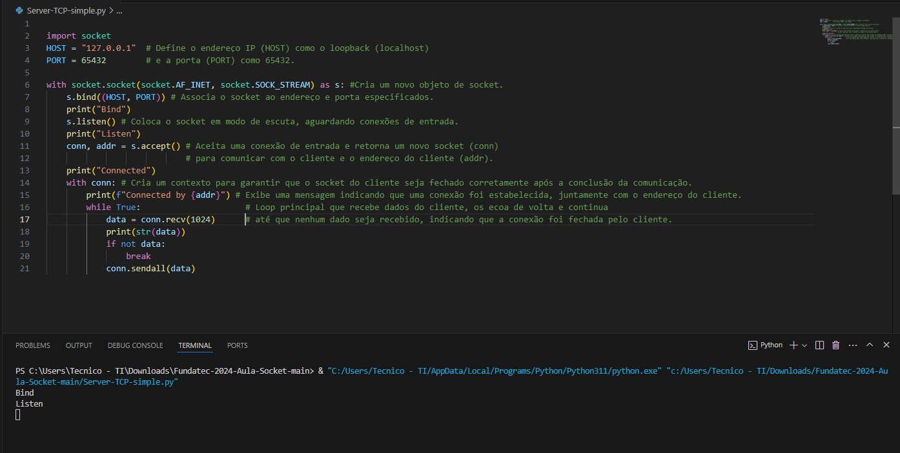

Explicação dos estados da conexão TCP:

Bind: Esta etapa associa o socket do servidor a um endereço IP e a uma porta específica no sistema. No código fornecido, s.bind((HOST, PORT)) realiza essa operação.

Listen: Após o bind, o socket entra no estado de escuta, onde fica aguardando por conexões de entrada. Isso é feito através do método s.listen(), onde o servidor começa a aceitar conexões.

Accept: Quando uma conexão é recebida, o servidor chama s.accept(), o que bloqueia o programa até que uma conexão seja estabelecida. Quando uma conexão é aceita, um novo socket é criado para se comunicar com o cliente.

Connected: Após a aceitação da conexão, o servidor e o cliente estão conectados e podem trocar dados.

Diferença entre a conexão UDP e TCP:

TCP (Transmission Control Protocol): É um protocolo orientado à conexão, confiável e bidirecional. Ele garante a entrega ordenada e sem erros dos dados. Usa o handshake de três vias (SYN, SYN-ACK, ACK) para estabelecer uma conexão.

UDP (User Datagram Protocol): É um protocolo sem conexão e não confiável. Ele envia os datagramas sem garantias de entrega, ordem ou integridade. Por isso, é mais rápido e usado em casos onde a perda de alguns dados não é crítica, como streaming de vídeo ou jogos online.

Explique as diferenças de multi conexões e porque a cada conexão a porta "muda": 

Conexões Sequenciais: Cada cliente é atendido um de cada vez, em uma ordem determinada pelo servidor. É simples de implementar, mas pode levar a um desempenho inferior quando muitas conexões estão ativas ou quando as solicitações são demoradas para processar.

Conexões Concorrentes: O servidor pode lidar com várias conexões simultaneamente, permitindo um melhor desempenho, especialmente em situações de alta carga. No entanto, isso requer lógica mais complexa para lidar com problemas de concorrência.

à mudança de porta a cada conexão, geralmente não ocorre em servidores típicos. O número da porta é usado para identificar o serviço, e enquanto ele geralmente permanece o mesmo, cada conexão terá seu próprio endereço de soquete único, composto pelo endereço IP e número da porta.

