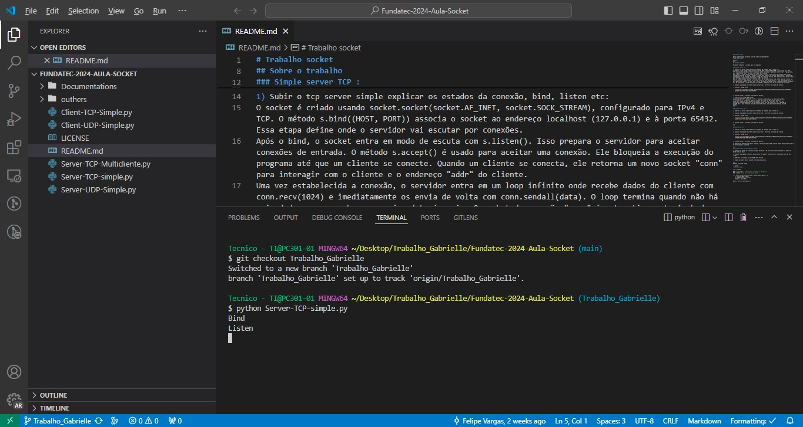
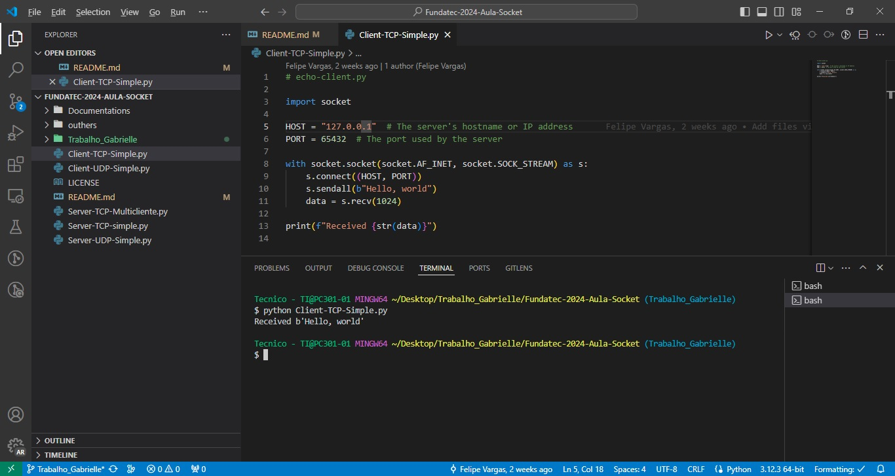

# Trabalho socket

Estes sockets fazem parte das aulas de redes de computadores!
Enjoy meus alunos!

Alunos!!!
***
## Sobre o trabalho

Documente com print e coloque aqui as respostas

### Simple server TCP :

### 1) Subir o tcp server simple explicar os estados da conexão, bind, listen etc:
   
### bind:
Quando um servidor cria um socket TCP, ele fica inicialmente em um estado não vinculado, o que significa que não está associado a um endereço IP e porta específica. Para disponibilizar o socket para conexões de entrada, o servidor precisa se vincular a um endereço IP e a alguma porta usando a bind().

### listen:
Depois de vincular o socket, o servidor precisa colocar em um estado de escuta usando a listen(). Isso indica que o servidor está pronto para aceitar conexões de entrada de clientes.
Quando o listen() é chamado, o sistema operacional configura uma fila para armazenar solicitações de conexão recebidas. O parâmetro backlog especifica o número máximo de conexões pendentes que podem ser enfileiradas antes que novas conexões sejam recusadas.

Resumindo, o bind() associa um socket a um endereço IP e a uma porta, enquanto listen() coloca o socket em estado de escuta, permitindo que o servidor aceite conexões de entrada de clientes.



### 2) Executar o programa de cliente simple server tcp e verificar os estados da conexão.


mfndklfndlf




3) Executar o programa de cliente simple server tcp e verificar os estados da conexão.

4) Analise o código fonte

   


6) Analise usando o wireshark explicando os pacotes.

7) Diferencie a conexão UDP de TCP:
A principal diferença entre UDP e TCP é a forma e o tempo com que os dados são enviados,
no formato UDP, a entrega dos dados ou a ordem deles não são garantidos, mesmo ele
sendo mais simples e ágil, não possui conexão. Por outro lado, o formato TCP, trás uma
garantia e confiabilidade maior na entrega dos dados, além de ordená-los, ele é baseado em
conexão. Ele é mais lento por causa do controle de fluxo, e da garantia de entrega que ele
propõe.
***

### Simple server UDP :

1) Subir o tcp server simple explicar os estados da conexão, bind, listen etc.

2) Executar o programa de cliente simple server tcp e verificar os estados da conexão.

3) Analise o código fonte

   


5) Analise usando o wireshark explicando os pacotes.

***

### Multiserver TCP :

1) Subir o tcp server simple explicar os estados da conexão, bind, listen etc.

2) Executar o programa de cliente simple server tcp e verificar os estados da conexão.

3) Analise o código fonte

   


5) Analise usando o wireshark explicando os pacotes.

6) Explique as diferenças de multi conexões e porque a cada conexão a porta "muda". Demonstre a mudança de porta usando o Wireshark

***
### Conexão com máquina remota do colega :

1) Subir o tcp server na máquina do colega, verificar o IP da máquina (certifique que ele esteja na mesma rede que você)

2) Executar o programa cliente na sua máquina, não esqueça de modificar o IP para a máquina do seu colega.

3) Demonstre com imagens que a conexão teve sucesso.

4) Usando wireshark mostra conexão filtrando pela portas.

***
Exemplo colocando código

```python
# echo-client.py

import socket

HOST = "127.0.0.1"  # The server's hostname or IP address
PORT = 65432  # The port used by the server

with socket.socket(socket.AF_INET, socket.SOCK_STREAM) as s:
    s.connect((HOST, PORT))
    s.sendall(b"Hello, world")
    data = s.recv(1024)

print(f"Received {str(data)}")
```


