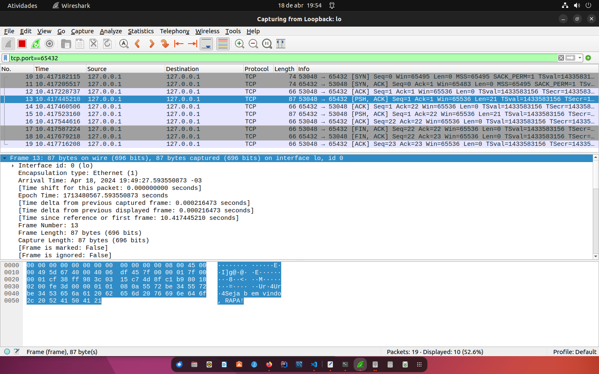

#Trabalho socket

Estes sockets fazem parte das aulas de redes de computadores! Enjoy meus alunos!

#Sobre o trabalho

#Documente com print e coloque aqui as respostas 
***
##Simple server TCP :

#####Subir o tcp server simple explicar os estados da conexão, bind, listen etc.
    Com o comando python3 Server-TCP-simple.py o programa inicia e lança duas mensagens 1) Bind (Vinculando) indicando a conexão entre um soquet e um endereço. Conforme o codigo em Python o endereço é do loopback 127.0.0.1 e a porta 65432 estas duas informações vão permanecer vinculadas.
    Em seguida o servidor envia uma msg indicando que ele esta escutando a porta, aguardando alguma mensagem direcionada para a porta. Isso é representado pela mensagem na tela de Listen (Escutando).
    
1)Executar o programa de cliente simple server tcp e verificar os estados da conexão.
    Ao executar no terminal o cliente TCP ele envia uma msg para o servidor que imprimi na tela as informações pertinentes a conexão tais como o ip do Cliente e a porta de comunicação. Além disso o servidor imprime a mensagem proveniente do cliente e na sequência dá um retorno ao cliente indicando que a mensagem foi ao servidor e retornou ao cliente indicando o sucesso da 'conversa' entre o cliente e o servidor. Por fim o servidor encerra a operação.
    
2)Analise o código fonte
    # echo-server.py
import socket
HOST = "127.0.0.1"  # Standard loopback interface address (localhost)
PORT = 65432  # Port to listen on (non-privileged ports are > 1023)
    # cria um contexto associando o socket com a variável 's' para simplificar a escrita do codigo
with socket.socket(socket.AF_INET, socket.SOCK_STREAM) as s:
    # socket vincula o host e a port definida nas variáveis
    s.bind((HOST, PORT))
    # imprimi msg na tela
    print("Vinculado")
    # socket fica auscultando a porta definida pela variável e ip definido
    s.listen()
    # imprimi msg na tela
    print("Escutando")
    # disponibilidade de aceite de mensagem conforme endereço 
    conn, addr = s.accept()
    # imprimi msg na tela
    print("Conectando")

    with conn:
        # imprimi msg na tela e o endereço do cliente
        print(f"Conectado por {addr}")
        # inicializa um loop
        while True:
            # atribui o conteúdo recebido a variável 'data'
            data = conn.recv(1024)
            # imprimi msg na tela com o conteudo da variavel 'data'
            print(str(data))
            # encerra na medida em que a variável data estiver vazia
            if not data:
                break
            # retorna a mensagem do cliente para o cliente com as letras maíusculas
            conn.sendall(data.upper())

3)Analise usando o wireshark explicando os pacotes.
    As informações 

4)Diferencie a conexão UDP de TCP
***
##Simple server UDP :
Simple server UDP :

    1)Subir o tcp server simple explicar os estados da conexão, bind, listen etc.

    2)Executar o programa de cliente simple server tcp e verificar os estados da conexão.

    3)Analise o código fonte

    4)Analise usando o wireshark explicando os pacotes.

***
##Multiserver TCP :

    1)Subir o tcp server simple explicar os estados da conexão, bind, listen etc.

    2)Executar o programa de cliente simple server tcp e verificar os estados da conexão.

    3)Analise o código fonte

    4)Analise usando o wireshark explicando os pacotes.

    5)Explique as diferenças de multi conexões e porque a cada conexão a porta "muda". Demonstre a mudança de porta usando o Wireshark

##Conexão com máquina remota do colega :

    1)Subir o tcp server na máquina do colega, verificar o IP da máquina (certifique que ele esteja na mesma rede que você)

    2)Executar o programa cliente na sua máquina, não esqueça de modificar o IP para a máquina do seu colega.

    3)Demonstre com imagens que a conexão teve sucesso.

    4)Usando wireshark mostra conexão filtrando pela portas.

